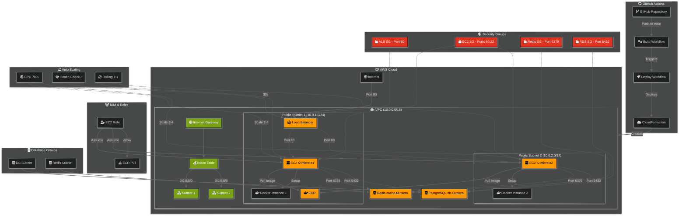

# AWS Infrastructure for Scalable Chat Application

This repository contains Infrastructure as Code (IaC) for deploying a scalable chat application on AWS using CloudFormation and GitHub Actions. The project has two main infrastructure components: GitHub Actions workflows for CI/CD and AWS CloudFormation for resource provisioning.

## Architecture Overview ([diagram.png](diagram.png))



## Infrastructure Components

### GitHub Workflows

#### 1. Build and push to ECR ([build.yml](.github/workflows/build.yml))
This workflow handles the building and publishing of container images:
- Triggers on pushes to the main branch
- Uses OpenID Connect (OIDC) for secure AWS authentication
- Sets up Docker Buildx for efficient image building
- Build the Python FastAPI application container
- Pushes the image to Amazon ECR with two tags:
  - Latest commit SHA
  - "latest" tag
- Stores the ECR image URI for the deployment workflow

#### 2. Deploy to CloudFormation ([deploy.yml](.github/workflows/deploy.yml))
This workflow manages the deployment of the infrastructure:
- Triggers automatically after successful image build
- Uses OIDC for AWS authentication
- Deploys/updates the CloudFormation stack with:
  - Latest container image
  - Database credentials
  - Infrastructure parameters
- Includes error handling and deployment validation
- Outputs stack information for verification

### AWS CloudFormation Infrastructure ([ec2-docker.yml](cloudformation/ec2-docker.yml))

#### Network Layer
- VPC with 2 public subnets across different availability zones
- Internet Gateway and route tables for public access
- Network ACLs and routing configuration

#### Application Layer
- Application Load Balancer (ALB) for traffic balancing
- Auto-scaling group (2-4 instances) of Docker-enabled EC2 instances
- Launch template with:
  - Automated Docker installation
  - Container pull and run configuration
  - Configuration of environment variables

#### Data Layer
- Redis cluster (cache.t3.micro) for real-time message synchronization
- PostgreSQL RDS instance (db.t3.micro) for message persistence
- Separate security groups for database and cache access

#### Security
- IAM roles and instance profiles for EC2-to-ECR access
- Security groups for:
  - ALB (port 80 inbound)
  - EC2 instances (ports 80, 22)
  - Redis (port 6379)
  - PostgreSQL (port 5432)

### Infrastructure Flow
1. Client traffic enters through the ALB
2. Requests are distributed to EC2 instances in the ASG
3. Docker containers run the FastAPI application
4. Real-time messages are handled via WebSocket and Redis
5. Persistent data is stored in PostgreSQL
6. Auto-scaling based on 70% CPU threshold

## Repository Structure
```
.
├── .github/workflows/
│   ├── build.yml        # ECR image build workflow
│   └── deploy.yml       # CloudFormation deployment workflow
├── cloudformation/
│   └── ec2-docker.yml   # Infrastructure template
├── app/                 # FastAPI Chat Application
│   ├── main.py         # FastAPI application entry point, API endpoints and WebSocket handlers, Redis and PostgreSQL connections
│   ├── templates/       # Frontend templates
│   └── assets/         # Frontend assets and templates
├── Dockerfile           # Application container definition
└── README.md

```

## Prerequisites

1. AWS Account
2. GitHub Repository
3. AWS IAM Role for GitHub Actions OIDC
4. ECR Repository
5. EC2 Key Pair
6. Required AWS permissions for CloudFormation, EC2, RDS, etc.

## Setup Instructions

### 1. Configure GitHub Repository Secrets

Navigate to Settings > Secrets and variables > Actions and add the following secrets:

```
AWS_REGION              # e.g., eu-west-1
AWS_ROLE_ARN           # arn:aws:iam::{account}:role/{role-name}
ECR_REPOSITORY         # repository-name
ECR_IMAGE_URI         # {account}.dkr.ecr.{region}.amazonaws.com/{repo}
EC2_KEY_PAIR          # Your EC2 key pair name
DB_USERNAME           # PostgreSQL admin username
DB_PASSWORD           # PostgreSQL admin password
```

### 2. Configure AWS IAM Role

Create an IAM role with the following trust relationship for GitHub Actions:

```json
{
    "Version": "2012-10-17",
    "Statement": [
        {
            "Effect": "Allow",
            "Principal": {
                "Federated": "arn:aws:iam::{account}:oidc-provider/token.actions.githubusercontent.com"
            },
            "Action": "sts:AssumeRoleWithWebIdentity",
            "Condition": {
                "StringLike": {
                    "token.actions.githubusercontent.com:sub": "repo:{org}/{repo}:*"
                }
            }
        }
    ]
}
```

Attach the following IAM policy to the role:

```json
{
    "Version": "2012-10-17",
    "Statement": [
        {
            "Effect": "Allow",
            "Action": [
                "cloudformation:*",
                "ec2:*",
                "elasticloadbalancing:*",
                "autoscaling:*",
                "rds:*",
                "elasticache:*",
                "iam:PassRole",
                "iam:CreateRole",
                "iam:PutRolePolicy",
                "iam:CreateInstanceProfile",
                "iam:AddRoleToInstanceProfile",
                "iam:AttachRolePolicy",
                "iam:GetRole",
                "iam:ListRoles",
                "iam:DeleteRole",
                "iam:DetachRolePolicy",
                "iam:DeleteRolePolicy",
                "iam:RemoveRoleFromInstanceProfile",
                "iam:DeleteInstanceProfile",
                "iam:CreateServiceLinkedRole"
            ],
            "Resource": "*"
        }
    ]
}
```

> **Note**: These permissions are intentionally broad for development purposes and to avoid deployment problems during the time-constrained development phase of the project. In a production environment, these permissions should be limited to the necessary actions and resources, following the principle of least privilege.

### 3. Create ECR Repository
#### Option A: Using AWS CLI
```bash
# Create the ECR repository
aws ecr create-repository \
    --repository-name {repo-name} \
    --region {region} \
```

#### Option B: Using AWS Management Console
1. Navigate to Amazon ECR in AWS Console
2. Click "Create repository"
3. Choose "Private" repository
4. Enter repository name
5. Click "Create repository"

The repository URI will be in the format:
`{account-id}.dkr.ecr.{region}.amazonaws.com/{repository-name}`

Make sure you write down the repository URI, as you'll need it for the GitHub Secrets configuration.

## Deployment

1. Push changes to the `main` branch
2. GitHub Actions will automatically:
   - Build and push the Docker image to ECR
   - Deploy/update the CloudFormation stack

## Zero-Downtime Deployments

The infrastructure supports zero downtime deployments through:
- Rolling updates with a minimum of 1 instance in service
- Maximum batch size of 1 instance
- Health checks via ALB

## Improvements

Several improvements could be made to make this infrastructure more production-ready. Some of these improvements were initially considered during the project planning phase but weren't implemented due to AWS Free Tier limitations.

1. Multi-AZ Setup
   - Enable Multi-AZ for RDS PostgreSQL for high availability
   - Deploy Redis in cluster mode across multiple AZs

2. Monitoring and Logging
   - Add CloudWatch alerts for:
     - EC2 instance metrics (CPU, Memory, Disk)
     - RDS performance metrics
     - Redis cache hit/miss rates
     - Application Load Balancer 5xx errors
   - Implement centralized logging with:
     - CloudWatch Logs for application logs
     - Log aggregation for container logs
     - Custom application metrics

3. Backup and Recovery
   - Configure automated RDS snapshots
   - Implement Redis backup strategy
   - Set up disaster recovery procedures
